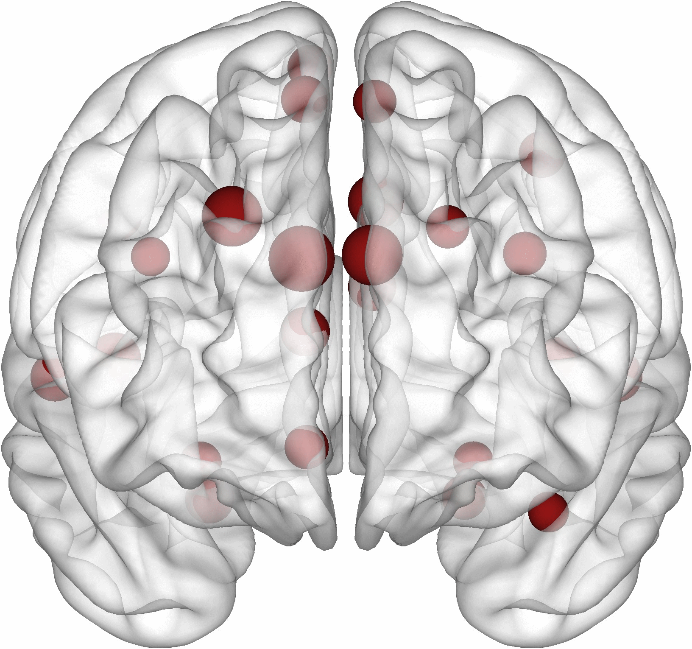
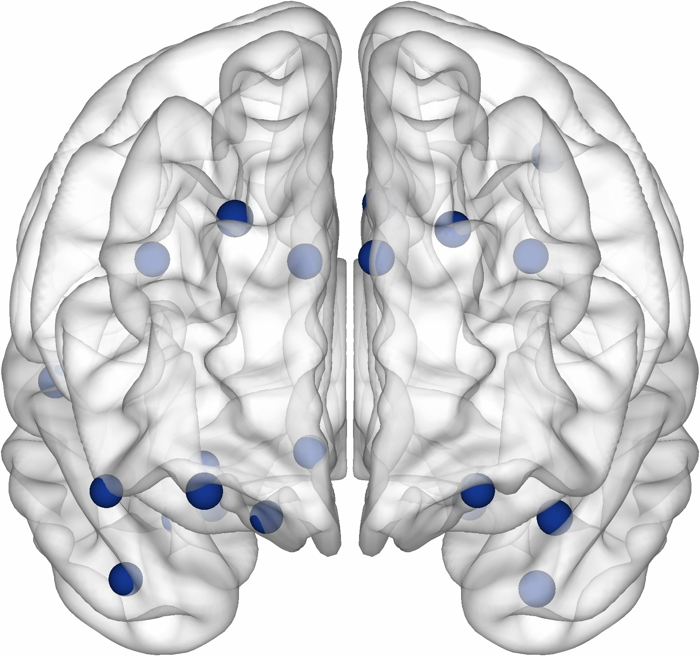
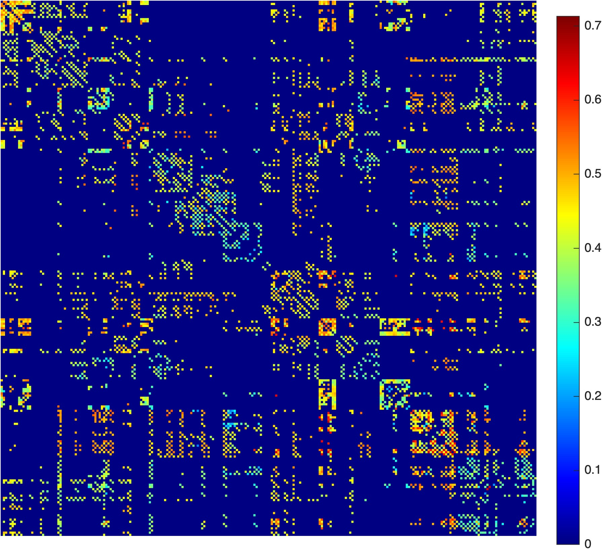
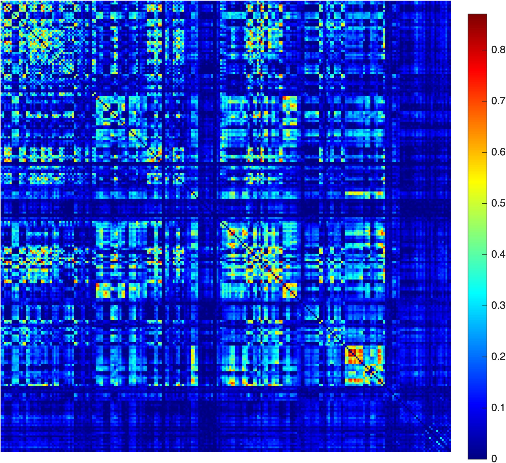

# BRAPH 2 Simulation

The **BRAPH 2 Simulation** distribution provides empirical brain data prepared for **numerical simulations**.  
It is designed as a teaching resource for:

> **FFR120 / FYM119 – Simulation of Complex Systems, lp2 HT25 (7.5 hp)**  
> Project work supervised by TA **Yu-Wei Chang**

This distribution uses the BRAPH 2 standard distribution (included in this repository in the `braph2/` folder) to visualise the data, as illustrated in the figures below.
For a general introduction to BRAPH 2, please refer to the main BRAPH 2 repository and tutorials.

---

## Overview of projects

The distribution is organised into two main project folders, each corresponding to one course project.

### Project J – Spreading Dynamics in Brain Networks

  
  

> **Example cross-sectional pathology patterns.**  
> These animations illustrate how amyloid (left) and tau (right) standardized uptake value ratio (SUVR) patterns change across diagnostic groups, from cognitively normal (CN) individuals without amyloid pathology to mild cognitive impairment (MCI) and Alzheimer’s disease (AD) with pathology. Together, they provide a compact visual summary of the typical AD spectrum used in this project.

**Folder:** `SpreadingDynamics/`

Project J focuses on modelling how pathological protein aggregates spread over brain networks.

Within `SpreadingDynamics/`, the following data are provided:

- **Structural brain networks**  
  - Derived from **diffusion tensor imaging (DTI)**  
  - Folder: `SpreadingDynamics/data/DTI`

- **Amyloid and tau pathology (SUVR maps)**  
  - Derived from **positron emission tomography (PET)**  
  - Amyloid data: `SpreadingDynamics/data/PET AMYLOID`  
  - Tau data: `SpreadingDynamics/data/PET TAU`

- **Brain atlas for network and PET data**  
  - AAL-based parcellation (subset of regions)  
  - File: `SpreadingDynamics/data/aal_selected_atlas.xlsx`

A more detailed description of the data structure, file formats, and suggested loading routines can be found in the project-specific documentation:

- `SpreadingDynamics/README.md`

---

### Project T – Brain Network Modelling

  
  

> **Example subject-level brain networks.**  
> These figures show an example **structural network** (left) and **functional network** (right) from the same healthy individual, illustrating how the empirical connectivity used in Project T looks in practice.

**Folder:** `NetworkModelling/`

Project T focuses on brain network modelling using both structural connectivity and functional time series.

Within `NetworkModelling/`, the following data are provided:

- **Structural brain networks**  
  - Derived from **diffusion tensor imaging (DTI)**  
  - Folder: `NetworkModelling/data/DTI`

- **Functional time series**  
  - Derived from **functional magnetic resonance imaging (fMRI)**  
  - Folder: `NetworkModelling/data/fMRI`

- **Brain atlas for network and fMRI data**  
  - BNA-based parcellation  
  - File: `NetworkModelling/data/bna_atlas.xlsx`

A more detailed description of the data structure, file formats, and suggested loading routines can be found in the project-specific documentation:

- `NetworkModelling/README.md`

---

## Usage in the course

Students in **FFR120 / FYM119** can use these data to:

- Build and explore **network-based models** of brain dynamics.
- Implement **spreading models** of pathology (Project J) over empirical structural networks.
- Implement **network models** that link structural connectivity to simulated or empirical functional time series and functional networks (Project T).

The precise simulation tasks, model assumptions, and evaluation criteria are defined in the **project instructions** provided separately by the course and TA.

---

## Data provenance and usage restrictions

The data are provided by 

- **Yu-Wei Chang (the corresponding TA)** – University of Gothenburg, Department of Physics
  <https://www.gu.se/en/about/find-staff/yu-weichang>
- **Dr. Mite Mijalkov** – Karolinska Institutet, Department of Clinical Neuroscience  
  <https://ki.se/en/people/mite-mijalkov>
- **Mr. Jiawei Sun** – Karolinska Institutet, Department of Clinical Neuroscience  
  <https://ki.se/en/people/jiawei-sun>  

Both collaborators are members of **Dr. Joana B. Pereira’s** group  
(Karolinska Institutet, Department of Clinical Neuroscience)  
<https://ki.se/en/people/joana-pereira>

The data are **exclusively** available for use within the above-mentioned course.  
Any use **beyond this scope** (including redistribution, publication, or re-use in other projects) is strictly prohibited.  
By using these data, students **automatically agree** to these terms.
